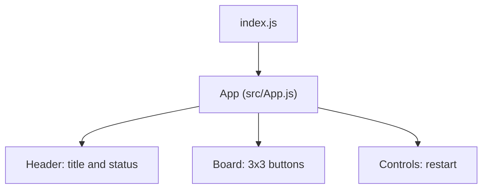

# Tic Tac Toe Frontend Architecture

## Overview

This document describes the architecture of the Tic Tac Toe frontend located in `two-player-tic-tac-toe-299005-299014/tic_tac_toe_frontend`. It covers system context, high-level structure, data flow, UI component tree, styling approach, accessibility, testing strategy, deployment workflow, environment variables, and external dependencies. The documentation reflects the current implementation in the repository and should be updated as features evolve.

## System Context

The frontend is a standalone React application built with Create React App (CRA). It renders a self-contained two-player Tic Tac Toe game that runs entirely in the browser. There are currently no network calls, no backend dependencies, and no persistence. The application can be served from any static hosting platform or via the CRA development server.

- Platform: Web (React 18)
- Entry point: `src/index.js`
- Root component: `src/App.js`
- Styles: `src/App.css` and `src/index.css`
- Tests: `src/App.test.js` with React Testing Library and Jest

## High-Level Architecture

The application uses a very simple, single-component architecture centered on the `App` component. The component owns all game state and renders the game board, status text, and controls. The app has no global state management library and no routing.

### Containers and Components

- Application shell
  - `index.html` (CRA generated) and `src/index.js`: Bootstraps React and mounts the root component into `#root` using `ReactDOM.createRoot`.
- UI component
  - `src/App.js`:
    - Maintains local state for board positions, turn tracking, and game-over status.
    - Computes derived values (winner/draw).
    - Renders the UI: header, status, 3x3 grid, and restart button.
    - Exposes a helper function `calculateWinner` for determining the winner, which is also imported by tests.

### Key Files

- `src/index.js`: Initializes the React app and renders `<App />` in `React.StrictMode`.
- `src/App.js`: Implements the full game logic and presentation.
- `src/App.css`: Contains the design system tokens (CSS variables) and component styles.
- `src/index.css`: Global baseline styles and font smoothing.
- `src/App.test.js`: Verifies rendering, move handling, win detection, draw detection, and disabled state after game over.

## Data Flow

All data is local to the `App` component:

- State variables:
  - `board: Array(9).fill(null) | ('X'|'O')[]` — the current board state.
  - `xIsNext: boolean` — tracks whose turn it is.
  - `gameOver: boolean` — true when there is a winner or a draw.

- Derived values:
  - `winner = useMemo(() => calculateWinner(board), [board])`
  - `isDraw = useMemo(() => !winner && board.every(c => c !== null), [winner, board])`

- Effects:
  - `useEffect` updates `gameOver` whenever `winner` or `isDraw` changes.

- Event handlers:
  - `handleCellClick(index)`:
    - Validates that the cell is empty and the game is not over.
    - Clones `board`, sets the clicked cell to `'X'` or `'O'`, toggles `xIsNext`.
  - `handleRestart()`:
    - Resets `board`, `xIsNext`, and `gameOver` to initial values.

There is no server communication. All state changes are synchronous and local to the component.

## UI Component Tree

The UI is small and flat. The grid is generated by mapping the `board` array; there are no child components extracted yet.

- App
  - header.ttt-header
    - h1.ttt-title
    - p.ttt-status
  - main.ttt-main
    - div.ttt-board (role="grid")
      - 9x button.ttt-cell (role="gridcell")
    - div.ttt-controls
      - button.ttt-restart

### Component Diagram



## Styling Approach

Styling is implemented with vanilla CSS using CSS variables to define the design tokens. The palette and spacing are tuned for a light, modern look.

- Design tokens in `src/App.css`:
  - `--bg`, `--surface`, `--text`, `--muted`, `--primary`, `--accent`, `--error`, `--border`, `--shadow`
- Component classes:
  - `.ttt-app`, `.ttt-main`, `.ttt-header`, `.ttt-title`, `.ttt-status`, `.ttt-board`, `.ttt-cell`, `.ttt-controls`, `.ttt-restart`
- Responsive design:
  - Uses `aspect-ratio` for square cells and `clamp` for font sizes to keep the board legible on various screen sizes.
  - Media query for small screens to adjust padding and title size.
- Interaction/touch:
  - Hover/active button transitions.
  - `touch-action: manipulation` and removing tap highlight for better mobile UX.

## Accessibility Considerations

The implementation includes semantic roles and ARIA attributes to assist screen reader navigation:

- The board container has `role="grid"` and `aria-label="Tic Tac Toe board"`.
- Each cell is a `<button>` with:
  - `role="gridcell"`
  - `aria-label` indicating the cell number and value when set (e.g., "Cell 1, X").
  - `aria-disabled` and `disabled` attributes when the cell is not interactable (either already selected or after game over).
- Status text uses `aria-live="polite"` to announce updates such as the next player, a win, or a draw.
- The title has `aria-label="Tic Tac Toe"` to improve clarity for assistive technologies.
- The restart button includes `aria-label="Restart game"`.

These attributes make the game navigable via keyboard and understandable to screen readers.

## Testing Strategy

Testing is implemented with Jest and React Testing Library via CRA:

- File: `src/App.test.js`
- Scenarios covered:
  - Renders the title and initial status ("Next player: X").
  - Allows a move and updates status to "Next player: O".
  - Detects a winning scenario and disables further moves.
  - Detects a draw scenario.
- Utilities and setup:
  - `@testing-library/jest-dom` is included in `src/setupTests.js`.

Future testing ideas:
- Snapshot testing of initial render.
- Unit tests for `calculateWinner` across all winning lines and invalid inputs.
- Accessibility checks using jest-axe or Storybook testing (if adopted).

## Deployment and Preview Workflow

- Development:
  - `npm start` uses CRA’s development server at port 3000.
  - Running container preview: `https://vscode-internal-33231-beta.beta01.cloud.kavia.ai:3000` (as provided by the environment).
- Testing:
  - `npm test` launches Jest in watch mode locally; CI can run in non-interactive mode if needed.
- Production build:
  - `npm run build` creates an optimized static bundle in `build/` suitable for static hosting (e.g., Netlify, Vercel, GitHub Pages, S3).
- Environment variables in CRA should be prefixed with `REACT_APP_` to be embedded at build time (see next section).

There is no custom preview or deployment configuration in the repo beyond CRA defaults.

## Environment Variables

The project definition lists these possible environment variables:
- REACT_APP_API_BASE
- REACT_APP_BACKEND_URL
- REACT_APP_FRONTEND_URL
- REACT_APP_WS_URL
- REACT_APP_NODE_ENV
- REACT_APP_NEXT_TELEMETRY_DISABLED
- REACT_APP_ENABLE_SOURCE_MAPS
- REACT_APP_PORT
- REACT_APP_TRUST_PROXY
- REACT_APP_LOG_LEVEL
- REACT_APP_HEALTHCHECK_PATH
- REACT_APP_FEATURE_FLAGS
- REACT_APP_EXPERIMENTS_ENABLED

Current impact:
- The current codebase does not read any environment variables. There are no references to `process.env.REACT_APP_*` in the source files.
- In CRA, environment variables are evaluated at build time. If future features require backend connectivity or flags, they should be read via `process.env.REACT_APP_<NAME>` and documented accordingly.
- The variable `REACT_APP_PORT` does not affect CRA’s dev server by default; CRA typically uses `PORT` (without prefix) at runtime. For variables to be embedded in the bundle, they must start with `REACT_APP_`.

Recommendation:
- Remove unused variables from the runtime environment or introduce documentation and code paths when they become relevant.
- If a backend is introduced, prefer a single `REACT_APP_API_BASE` and derive URLs for HTTP and WebSocket endpoints as needed.

## External Service Dependencies

- None at present. The game operates entirely client-side with no calls to external APIs or services.
- NPM dependencies (from `package.json`):
  - "react": "^18.2.0"
  - "react-dom": "^18.2.0"
  - "react-scripts": "^5.0.1"
  - dev: "cross-env": "^7.0.3"
- ESLint configuration is provided via `eslint.config.mjs`, using `@eslint/js` and `eslint-plugin-react`. CRA also carries its default ESLint config through `"eslintConfig": { "extends": "react-app" }`.

## High-Level Data and Control Flow

```mermaid
sequenceDiagram
  autonumber
  participant User
  participant App
  participant calculateWinner

  User->>App: Click cell i
  App->>App: validate (empty, not gameOver)
  App->>App: setBoard([...]); setXIsNext(!xIsNext)
  App->>calculateWinner: calculateWinner(board)
  calculateWinner-->>App: winner | null
  App->>App: compute isDraw
  App->>App: setGameOver(winner || isDraw)
  App-->>User: Re-render UI (status, cells, restart)
```

## UI States

- Initial: Empty 3x3 grid, "Next player: X".
- In progress: Cells filling, status alternates between "Next player: X" and "Next player: O".
- Win: "Winner: X" or "Winner: O", cells disabled.
- Draw: "Draw!", cells disabled.
- Restart: Resets to initial state.

## Future Extensions

- Split `App` into smaller presentational components: `Board`, `Cell`, and `Status`.
- Add persistence (e.g., localStorage) to keep game state across refreshes.
- Add an AI/CPU opponent mode or online multiplayer (would introduce backend dependencies).
- Internationalization of status messages.
- Feature flags (e.g., via `REACT_APP_FEATURE_FLAGS`) to toggle optional behavior.
- Add ESLint/Prettier integration and CI lint/test workflows.

## Appendix: Component API

- App (default export)
  - Props: none
  - State:
    - board: string[] | null[]
    - xIsNext: boolean
    - gameOver: boolean
  - Handlers:
    - handleCellClick(index: number): void
    - handleRestart(): void
- calculateWinner(squares: (string|null)[]): 'X' | 'O' | null

## References

- React 18 with CRA
- React Testing Library and Jest (CRA defaults)
- Styles and tokens defined in `src/App.css`
